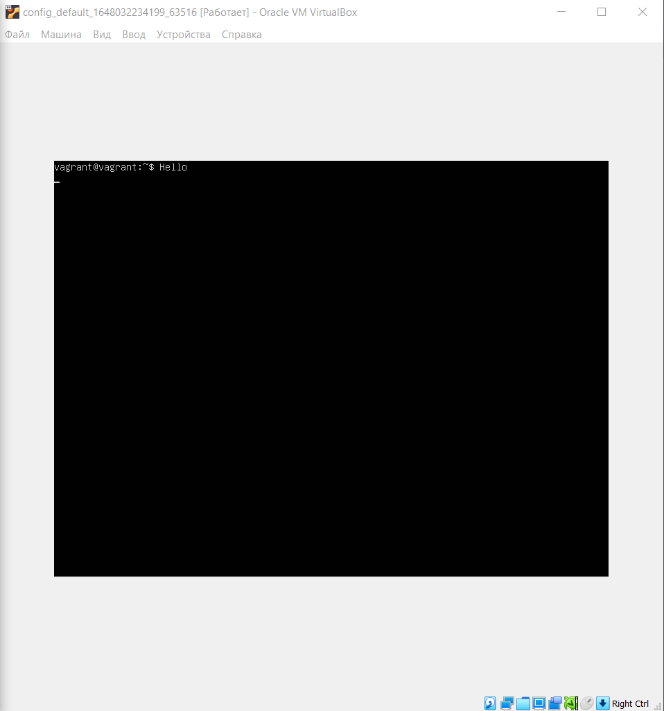

# Homework 03-sysadmin-02-terminal

1. Команда `cd` имеет тип builtin (встроена непосредственно в Bash). Она именно такого типа из-за необходимости прямого доступа к внутренним структурам командного интерпретатора, например она меняет указатель на текущую папку в самом Bash, в таком случае логично работать внутри сессии терминала; В случае если мы сделаем внешний исполняемый файл с похожей функциональностью процесс будет дочерним относительно породившего его Bash и будет работать в своём окружении отдельно.
2. Альтернативой будет например `grep <some_string> <some_file> -c` опция `-с` сама по себе меняет вывод команды `grep` на счетчик совпадающих строк.
3.     vagrant@vagrant:~$ pstree -p | head -n4
       systemd(1)-+-VBoxService(835)-+-{VBoxService}(843)
           |                  |-{VBoxService}(844)
           |                  |-{VBoxService}(845)
           |                  |-{VBoxService}(846)  
    Соответственно, процесс systemd
4. Допустим, что наш терминал /dev/pts/0, stderr имеет файловый дескриптор 2. Соответственно, мы должны использовать например такую строчку `vagrant@vagrant:~$ ls -l 2>/dev/pts/1`
5.     vagrant@vagrant:~$ echo string > testfile
       vagrant@vagrant:~$ cat < testfile  > testfile2
       vagrant@vagrant:~$ cat testfile2
       string
6. Вывести получится. Перенаправляем вывод `vagrant@vagrant:~$ echo Hello > /dev/tty1` . Смогу наблюдать если например запущу GUI для виртуальной машины  

7.     vagrant@vagrant:~$ bash 5>$1
       -bash: $1: ambiguous redirect.  
    Эта команда привела к перенаправлению вновь созданного FD 5 туда же куда и FD 1 (т.е. STDOUT)  

       vagrant@vagrant:~$ bash 5>&1
       vagrant@vagrant:~$ ls -l /proc/$$/fd
       total 0
       lrwx------ 1 vagrant vagrant 64 Mar 25 13:39 0 -> /dev/pts/0
       lrwx------ 1 vagrant vagrant 64 Mar 25 13:39 1 -> /dev/pts/0
       lrwx------ 1 vagrant vagrant 64 Mar 25 13:39 2 -> /dev/pts/0
       lrwx------ 1 vagrant vagrant 64 Mar 25 13:39 255 -> /dev/pts/0
       lrwx------ 1 vagrant vagrant 64 Mar 25 13:39 5 -> /dev/pts/0
       vagrant@vagrant:~$ echo netology > /proc/$$/fd/5
       netology  
    В текущей сессии с PID $$ мы добавили новый дескриптор 5 и направили его в STDOUT, поэтому перенаправление вывода команды `echo` привело к тому, что её вывод распечатался в терминале SDOUT
8. Задача заключается в том, чтобы поменять STDERR и STDIN местами используя новый дескриптор 4    

       vagrant@vagrant:~$ ls
       test
       vagrant@vagrant:~$ ls test test2
       ls: cannot access 'test2': No such file or directory
       test
       vagrant@vagrant:~$ ls /proc/$$/fd/
       0  1  2  255  4
       vagrant@vagrant:~$ bash 4>&2
       vagrant@vagrant:~$ ls /proc/$$/fd
       0  1  2  255  4
       vagrant@vagrant:~$ ls test test2 test3 4>&2 2>&1 1>&4 | wc -l
       test
       2
9. Команда `cat /proc/$$/environ` выведет переменные окружения. Еще можно получить аналогичный по содержанию вывод командой `printenv` и `env`.
10.   `/proc/<PID>/cmdline` (Manual page proc(5) line 226/3596): содержит полный путь до процесса, если этот процесс не zombie;  
`/proc/<PID>/exe` (Manual page proc(5) line 279/3596): этот файл представляет собой символьную ссылку, содержащую фактический путь к выполняемому процессу.
11.  `vagrant@vagrant:~$ grep sse /proc/cpuinfo` SSE 4.2
12. Сложно было что-то найти. При выполнении подключения нет локального tty в данный момент и ожидается пользователь, а не другой процесс. `man ssh` рассказывает о том, что ключ `-t` позволяет принудительно выделить псевдотерминал.

        vagrant@vagrant:~$ man ssh
        vagrant@vagrant:~$ ssh -t localhost 'tty'
        vagrant@localhost's password:
        /dev/pts/1
        Connection to localhost closed.
        vagrant@vagrant:~$.
13. Перед тем как проделывать, согласно мануалу, поправил значение ptrace_scope с "0" на "1"  

        vagrant@vagrant:/etc/sysctl.d$ ps -a
        PID TTY          TIME CMD
        1216 pts/1    00:00:00 top
        1228 pts/0    00:00:00 ps
        vagrant@vagrant:/etc/sysctl.d$ sudo reptyr -T 1216
        vagrant@vagrant:~$ ps -a
        PID TTY          TIME CMD
        1216 pts/1    00:00:00 top
        1240 pts/0    00:00:00 sudo
        1241 pts/0    00:00:05 reptyr
        1258 pts/1    00:00:00 ps
        vagrant@vagrant:~$ pstree
        systemd─┬─VBoxService───8*[{VBoxService}]
                ├─accounts-daemon───2*[{accounts-daemon}]
                ├─agetty
                ├─atd
                ├─cron
                ├─dbus-daemon
                ├─irqbalance───{irqbalance}
                ├─multipathd───6*[{multipathd}]
                ├─networkd-dispat
                ├─polkitd───2*[{polkitd}]
                ├─rsyslogd───3*[{rsyslogd}]
                ├─snapd───10*[{snapd}]
                ├─sshd─┬─sshd───sshd───bash───sudo───reptyr
                │      └─sshd───sshd───bash─┬─pstree
                │                           └─top
                ├─systemd───(sd-pam)
                ├─systemd-journal
                ├─systemd-logind
                ├─systemd-network
                ├─systemd-resolve
                ├─systemd-udevd
                └─udisksd───4*[{udisksd}]

14.`tee` делает вывод одновременно в STDOUT и файл, указанный в качестве параметра. В данном примере команда получает вывод из STDIN, перенаправленный через pipe от STDOUT команды, которая была запущена от суперпользователя (sudo echo)
и sudo, соответственно, имеет права на запись в файл.
